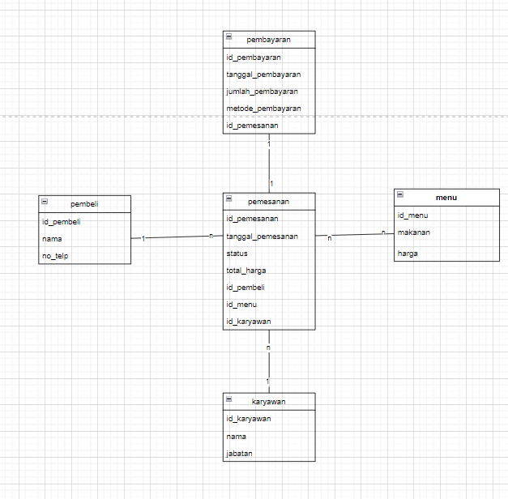

# CASE PROJECT : MANAJEMEN RESTORAN

Deskripsi: Project ini bertujuan untuk membangun sistem manajemen Restoran yang berfungsi untuk memanage 
System Perorderan. Sistem ini akan memfasilitasi pengelolaan interaksi antara pelanggan, karyawan, dan departemen yang mereka wakili.

Project ini dibuat menggunakan teknologi Express.js dengan ORM Sequelize, serta mendukung operasi CRUD (Create, Read, Update, Delete) untuk setiap entitas dalam sistem.

# DESKRIPSI CASE 

Dalam project ini terdapat beberapa entitas utama yang berhubungan satu sama lain:

1. Karyawan : Pelayan yang bertugas di restoran.
2. Pelanggan : Pelanggan yang membeli di restoran.
3. Menu: List Makanan yang ada di restoran.
4. Pemesanan : List makanan yang akan di hidangkan.
5. Pembayaran : self explanatory.

# RELASI ANTAR ENTITAS 

1.Pelanggan ke Pemesanan:
- Setiap pelanggan dapat memiliki satu atau lebih pemesanan.
- Relasi: One-to-Many

2.Karyawan ke Pemesanan:
- Setiap Karyawan dapat menangani satu atau lebih pemesanan.
- Relasi: One-to-Many

3.Pembayaran ke Pemesanan:
- Setiap pembayaran hanya bisa menerima satu pemesnanan.
- Relasi: One-to-one

4.Menu ke Pemesanan:
- Setiap menu dapat memiliki lebih dari 1 pemesanan.
- Relasi: Many-to-Many


## Dependecies / Teknologi yang digunakan 💻

1. **npm init -y**

    Perintah ini digunakan untuk secara otomatis menginisialisasi dan membuat file `package.json`

    ```bash
    npm init -y
    ```

2. **express**

    Express JS sebagai framework Node.js untuk mengelola request dan response HTTP

    ```bash
   npm i express
    ```

3. **mysql**

    package untuk melakukan koneksi ke database

    ```bash
    npm i mysql
    ```

4. **dotenv**

    Dotenv untuk mengatur variabel lingkungan
    ```bash
    npm i dotenv
    ```

5. **cors**

    Untuk memberikan akses pada forntEnd

    ```bash
    npm i cors
    ```
6. **sequelize**

    Sebagai Orm yang dipakai

    ```bash
    npm i sequelize
    ```


7. **nodemon**

    jalankan dengan mengetikan perintah (nodemon namaFile)

    ```bash
    npm install nodemon
    ```

    Perintah ini akan menjalankan server secara terus menerus

    Aplikasi akan berjalan pada port yang ditentukan di file `.env` .

Untuk menginstal semua dependensi ini sekaligus, Anda bisa menjalankan perintah berikut di terminal di direktori proyek Anda:

```bash
npm install body-parser cors dotenv express mysql nodemon sequelize
```

<br>
    

# CLASS DIAGRAM 

 
# ERD (Entity Relationship Diagram) 


<br>

# RELASI TABLE


<br>

# MADE BY 
```
Nama : Iaka Azkiano ...
Kelas : XII PPLG .. 
Mapel : Produktif PPLG ...
Tugas : Sequelize ...
```


